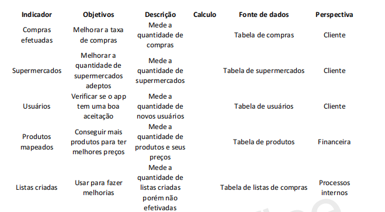

# Especificações do Projeto

Sabemos que um dos maiores gastos das pessoas é sua compra mensal/semanal, até porque é indispensável o alimento diário, porém os usuários enfrentam um grande problema ao encontrar um supermercado com o  melhor preço para fazer suas compras, principalmente com o preço das coisas aumentando cada vez mais. É pensando nisso que criamos esse projeto, onde os próprios consumidores também podem contribuir com o aplicativo, que informa aos usuários o lugar com o melhor preço para fazer suas compras, também preços dos produtos individuais,  e assim ter a oportunidade de diminuir nos gastos. 

## Personas

## Carla Diaz 
| **Informações Pessoais** | **Sites e Aplicativos** | **Motivações** |
| --- | --- | --- |
| Idade: 24 anos| Telegram| Já fez uso de um aplicativo de preço de produtos, porém ele não dava disponibilidade de o usuário inserir informações.|
| Estado Civil: Casada | Youtube | Gostaria de um aplicativo onde pudesse olhar os menores preços, mas também colaborar com o aplicativo inserindo informações sobre os preços e compras. | |
| Naturalidade: Montes Claros, MG | Google | - |
| Tipo de moradia atual: Apartamento alugado | Facebook| - |
| Cidade em que reside atualmente:  Montes Claros, MG| Instagram | - |
| Formação: Recursos Humanos | WhatsApp | - |
| Ocupação: Estagiária | - | - |

| **Frustração:**| **Hobbies:**|
| --- | --- |
| Dificuldade em ajudar outras pessoas com informações de preços dos produtos, e de achar produtos mais baratos. | Gosto de  Assistir séries e Caminhar no parque aos fins de semana | - |

## Paulo da Silva 
| **Informações Pessoais** | **Sites e Aplicativos** | **Motivações** |
| --- | --- | --- |
| Idade: 40 anos  | Facebook| Já fez uso de um aplicativo que não mostrava o preço das compras, somente dos produtos individuais.|
| Estado Civil: Casado | WhatsApp |Gostaria de um aplicativo que  mostrasse o preço das compras dos produtos, para visualizar o  supermercado mais em conta para as compras mensais da família. ||
| Naturalidade: Belo Horizonte, MG | YouTube | - |
| Tipo de moradia atual: Casa alugada | - | - |
| Cidade em que reside atualmente:  Belo Horizonte, MG| - | - |
| Formação: Ensino médio | - | - |
| Ocupação: Pedreiro | - | - |

| **Frustração:**| **Hobbies:**|
| --- | --- |
| Dificuldade em achar o melhor preço para compras. | Nos finais de semana que não trabalho, gosto de estar com meus filhos, assistir um filme, e também gosto de pescar. | - |

## Márcia Gomes
| **Informações Pessoais** | **Sites e Aplicativos** | **Motivações** |
| --- | --- | --- |
| Idade: 35 anos  | Instagram| Nunca fez uso de um aplicativo de preço de compras, e sente a necessidade de um aplicativo que a ajude a economizar nas compras.|
| Estado Civil: Casada | Facebook | Gostaria de um aplicativo que agilizasse sua procura por preços de produtos mais em conta nos supermercados, onde  pudesse ver os preços de cada um e comprar no mercado onde fica mais em conta . ||
| Naturalidade: Rio de Janeiro,RJ | WhatsApp | - |
| Tipo de moradia atual: Apartamento alugado | YouTube | - |
| Cidade em que reside atualmente: Salvador, BA | - | - |
| Formação: Letras | - | - |
| Ocupação: Professora de Português | - | - |

| **Frustração:**| **Hobbies:**|
| --- | --- |
| Dificuldade em se deslocar para procurar melhores preços de compras e produtos| Geralmente nas minhas folgas gosto de ler livros, e aproveitar o tempo livre com meu marido, ir ao cinema, andar de bicicleta, e ir ao parque. | - |

##  Ana Beatriz 
| **Informações Pessoais** | **Sites e Aplicativos** | **Motivações** |
| --- | --- | --- |
| Idade: 26 anos  | TikTok | Já pesquisou sobre preços de compras em supermercados diferentes, mas não encontrava nada concreto.|
| Estado Civil: Casada | Instagram | Gostaria de um aplicativo que fosse dinâmico e prático para olhar esses preços com praticidade, sem precisar ficar se deslocando ou pesquisando em lugares diferentes. ||
| Naturalidade: São Paulo, SP | WhatsApp | - |
| Tipo de moradia atual: Casa própria | YouTube | - |
| Cidade em que reside atualmente:  Caratinga, MG  | Facebook | - |
| Formação: Ensino médio | - | - |
| Ocupação: Do lar | - | - |

| **Frustração:**| **Hobbies:**|
| --- | --- |
| Dificuldade em encontrar aplicativos onde mostrasse preço de compras sem precisar pesquisar em todo lugar| Gosto de ir ao cinema com minha família, andar de bicicleta, e fazer crochê.  | - |

##  José Roberto  
| **Informações Pessoais** | **Sites e Aplicativos** | **Motivações** |
| --- | --- | --- |
| Idade: 50 anos  | Facebook | Já utilizou um aplicativo de preços de produtos, mas não informava onde eram os supermecados.|
| Estado Civil: Casado | YouTube | Gostaria de um aplicativo que mostre o preço dessas compras e onde o supermercado com a compra de menor preço se localiza. ||
| Naturalidade: Patos de Minas, MG | WhatsApp | - |
| Tipo de moradia atual: Casa própria | - | - |
| Cidade em que reside atualmente:  São Bernardo, SP  | - | - |
| Formação: Ensino médio | - | - |
| Ocupação: Do lar | - | - |

| **Frustração:**| **Hobbies:**|
| --- | --- |
| Dificuldade em encontrar aplicativos onde mostre a localização do supermercado com a compra de menor preço |Gosto de assistir jogos de futebol, e sair para caminhar nas folgas.  | - |

## Luis Felipe
| **Informações Pessoais** | **Sites e Aplicativos** | **Motivações** |
| --- | --- | --- |
| Idade: 18 anos | Twitter | Utiliza ferramentas de busca na internet e no smartphone para encontrar produtos em promoção. |
| Estado Civil: Solteiro | Youtube | Participa de comunidades na internet e no smartphone de caçadores de promoção em busca de cupons de desconto. |
| Naturalidade: Belo Horizonte, MG | Google | Cria alertas de produtos em sites informando o preço ideal. |
| Tipo de moradia atual: casa, Mora com os pais | Facebook|Gostaria que um site ou aplicativo permitisse a criação de uma lista de produtos e indicasse o estabelecimento próximo de sua residência com menor preço. |
| Cidade em que reside atualmente: Belo Horizonte, MG | Instagram | - |
| Formação: Ensino Médio | WhatsApp | - |
| Ocupação: Estudante, Cursando graduação em Computação | - | - |

| **Frustações:**| **Hobbies, História:** |
| --- | --- |
| Gastar um tempo longo para pesquisar promoções de diversos produtos, tendo em vista que depende do dinheiro dos pais para adquiri-los. | Andar de bicicleta, jogar vídeo game, ler mangás, brincar com os cachorros, fazer trilha e cachoeira. |

## Maria de Fátima
| **Informações Pessoais** | **Sites e Aplicativos** | **Motivações** |
| --- | --- | --- |
| Idade: 50 anos | TV aberta | Anota promoções de produtos em comerciais de TV. |
| Estado Civil: Casada | WhatsApp | Guarda folhetos de supermercados para consulta de preços de produtos. |
| Naturalidade: Belo Horizonte, MG | Facebook | Busca produtos em oferta na internet em empresas tradicionais do ramo varejista. |
| Tipo de moradia atual: casa própria | Youtube|Gostaria que um site ou aplicativo permitisse a criação de uma lista de produtos e indicasse o estabelecimento próximo de sua residência com menor preço. |
| Cidade em que reside atualmente: Belo Horizonte, MG | Facebook | Recebe de amigos (as) anúncios de produtos em promoção pelo whatsapp. |
| Formação: Ensino superior | - | Gostaria que um site ou aplicativo permitisse a criação de uma lista de produtos e indicasse o estabelecimento próximo de sua residência com menor preço. |
| Ocupação: Professora aposentada | - | - |

| **Frustações:**| **Hobbies, História:** |
| --- | --- |
| Controlar junto com seu marido a lista de compras no supermercado, precisando às vezes retirar produtos do carrinho de compras quando o valor excede ao que eles podem gastar. | Cuidar de plantas, leitura, assistir TV e filmes, visitar familiares e amigos (as). |
| - | - |

## Patrícia Silva
| **Informações Pessoais** | **Sites e Aplicativos** | **Motivações** |
| --- | --- | --- |
| Idade: 35 anos | WhatsApp | Utiliza ferramentas de busca na internet e no smartphone para encontrar produtos em promoção. |
| Estado Civil: Casada | Instagram | Compra produtos em empresas tradicionais do ramo varejista com cupons promocionais. |
| Naturalidade:São Paulo, SP | Google | Cria alertas de produtos em sites informando o preço ideal. |
| Tipo de moradia atual: Apartamento | Facebook | Participa de grupos no whatsapp com amigos(as) para compra coletiva em busca preços menores. |
| Cidade em que reside atualmente: São Paulo, SP | - | Gostaria que um site ou aplicativo permitisse a criação de uma lista de produtos e indicasse o estabelecimento próximo de sua localidade com menor preço. |
| Formação: Graduação em Ciencias Contábeis | - | - |
| Ocupação: Analista Tributária | - | - |

| **Frustações:**| **Hobbies, História:** |
| --- | --- |
| Ter mais tempo para aproveitar com família e amigos. | Viajar, dançar, confraternizar amigos(as), além de curtir a família (tenho 2 filhos). |

## Tereza Aparecida
| **Informações Pessoais** | **Sites e Aplicativos** | **Motivações** |
| --- | --- | --- |
| Idade: 60 anos | TV aberta | Não utiliza ferramentas de busca na internet e nem no smartphone para encontrar produtos em promoção. |
| Estado Civil: viúva | WhatsApp | Realiza compras em estabelecimentos de bairro, próximos de sua residência. |
| Naturalidade: Belo Horizonte, MG | Youtube | Utiliza smartphone apenas para conversar com amigos(as) e familiares. |
| Tipo de moradia atual: casa própria, mora com um filho adulto | Facebook | Gostaria de uma maneira simples de pesquisar preços de produtos próximo de sua residência. |
| Cidade em que reside atualmente: Betim, MG | - | - |
| Formação: Ensino Médio | Linkedin | - |
| Ocupação: Dona de casa, pensionista| - | - |

| **Frustações:**| **Hobbies, História:** |
| --- | --- |
| Dificuldade de locomoção para lugares distantes. | Cuidar de suas plantas, cachorros, assistir TV. |

## Histórias de Usuários

Com base na análise das personas foram identificadas as seguintes histórias de usuários:

|EU COMO... `PERSONA`| QUERO/PRECISO ... `FUNCIONALIDADE` |PARA ... `MOTIVO/VALOR`                 |
|--------------------|------------------------------------|----------------------------------------|
|Luis Felipe| ter a opção de informar sua localização instantanea e pesquisar uma lista de produtos próximo da mesma| que quando quiser, em qualquer lugar com rede de dados, pesquisar preços de um conjunto de produtos|
|Luis Felipe| ter a opção de compartilhar a lista criada de produtos| compartilhar detalhadamente o preço de cada produto da lista com um grupo de amigos(as) ou os pais|
|Maria de Fátima| receber produtos similares na pesquisa, caso não seja encontrado o produto requerido| que a pesquisa retorne o maior número de produtos listados|
|Maria de Fátima| ter a opção de criar uma lista favorita de produtos e marcá-los no momento da compra a medida que forem sendo inseridos no carrinho de compras| que possa marcar os produtos já inseridos no carrinho de compras no supermercado|
|Patrícia Silva| ter a opção de criar uma lista favorita de produtos| que possa criar diferentes listas de produtos|
|Patrícia Silva| ter a opção de compartilhar a lista criada de produtos| compartilhar detalhadamente o preço de cada produto da lista com um grupo de amigos(as) ou familiares|
|Tereza Aparecida| ter a opção de encontrar produtos de menor preço próximo a sua residência| que quando necessário eu possa consultar preço de produtos próximo a minha residência|

## Modelagem do Processo de Negócio 

### Análise da Situação Atual

Apresente aqui os problemas existentes que viabilizam sua proposta. Apresente o modelo do sistema como ele funciona hoje. Caso sua proposta seja inovadora e não existam processos claramente definidos, apresente como as tarefas que o seu sistema pretende implementar são executadas atualmente, mesmo que não se utilize tecnologia computacional. 

### Descrição Geral da Proposta

Apresente aqui uma descrição da sua proposta abordando seus limites e suas ligações com as estratégias e objetivos do negócio. Apresente aqui as oportunidades de melhorias.

### Processo 1 – NOME DO PROCESSO

Apresente aqui o nome e as oportunidades de melhorias para o processo 1. Em seguida, apresente o modelo do processo 1, descrito no padrão BPMN. 

### Processo 2 – NOME DO PROCESSO

Apresente aqui o nome e as oportunidades de melhorias para o processo 2. Em seguida, apresente o modelo do processo 2, descrito no padrão BPMN.

## Indicadores de Desempenho

Apresente aqui os principais indicadores de desempenho e algumas metas para o processo. Atenção: as informações necessárias para gerar os indicadores devem estar contempladas no diagrama de classe. Colocar no mínimo 5 indicadores. 

Obs.: todas as informações para gerar os indicadores devem estar no diagrama de classe a ser apresentado posteriormente. 

## Requisitos

Ao começar um projeto todos os requisitos devem ser levantados, entendidos e documentado. O escopo deste projeto é definido por meio de requisitos funcionais, que são as características que definem os critérios de aceitação do produto e a necessidade do cliente, e requisitos não funcionais que é voltado pelas características de qualidade que o sistema todo ou uma funcionalidade em específico deve ter.
Para determinar a prioridade de requisitos, aplicamos o método MoSCoW, é uma técnica usada em gestão, análise de negócios, desenvolvimento de software e gerenciamentos de projetos. Ela é utilizada para definir a prioridade e a importância das tarefas que compõem um projeto, é entendida como um acrônimo e cada uma das sua classificações origina-se no inglês. A seguir, apresentamos a ordem de importância:

- Must Have (tenho que fazer)
- Should Have (devo fazer)
- Could Have (poderia fazer)
- Won’t Have (não será feito "por enquanto")

As tabelas que se seguem apresentam os requisitos funcionais e não funcionais do projeto, identificando a prioridade em que os mesmos devem ser entregues. 
### Requisitos Funcionais

|ID    | Descrição do Requisito  | Prioridade |
|------|-----------------------------------------|----|
|RF-01 | Permitir cadastrar usuario consumidor. | MUST | 
|RF-02 | Permitir ao consumidor criar uma lista de compras.  | MUST |
|RF-03 | Inserir informações dos produtos por meio de uma API. | MUST | 
|RF-04 | Permitir ao consumidor, de forma colaborativa, inserir informações sobre determinado produto e carregar imagem que comprove.   | MUST |
|RF-05 | Retornar ao usuario a lista cadastrada informando o preço total. | MUST | 
|RF-06 | Retornar ao usuario o total por supermercado mais proximo de sua localização.   | MUST |
|RF-07 | Sugerir um produto similar, caso o solicitado na lista não tenha na base. | SHOULD | 
|RF-08 | Salvar lista de favoritos.   | WON'T |
|RF-09 | Compartilhar a lista. | COULD | 
|RF-10 | Permitir ao usuario realizar um checklist da compra.   | COULD |
|RF-11 | Permitir ao usuario finalizar a compra somente pela opção de retirada e pagamento no estabelecimento. | WON'T | 

### Requisitos não Funcionais

|ID     | Descrição do Requisito  |Prioridade |
|-------|-------------------------|----|
|RNF-01 | Segurança na criação de usuário, a necessidade de criptografia de senhas e demais questões relacionadas para garantir a proteção dos dados.   | MUST | 
|RNF-02 | O formulário de cadastro devem informar ao usuário quais são os campos de preenchimento obrigatório.  |  MUST | 
|RNF-03 | Utilizar símbolo e ícone para ajudar no entendimento e conseguir uma associação imediata sobre aplicações de reconhecimento.	   |  WON'T |
|RNF-04 | A aplicação deve ser intuitiva, de fácil utilização, entendimento e deve ser organizado de tal maneira que os erros dos usuários sejam minimizados.    |  COULD |
|RNF-05 | A aplicação deve possuir uma interface limpa, com visualização voltada para as necessidades do usuário no momento, também como forma de melhorar a performance e o desempenho.   |  COULD |
|RNF-06 | A aplicação ou parte dela deve ser acessível por pessoas com certo tipo de deficiência ou outra necessidade específica.   |  COULD |
|RNF-07 | A aplicação deverá ser responsivo.  |  COULD |
|RNF-08 | A aplicação deve manter histórico de alteração de dados de produtos por cinco anos.   |  SHOULD |
|RNF-09 |A aplicação deverá armazenar a data de inclusao/alteração de um produto. |  MUST |

## Restrições

|ID| Restrição                                             |
|--|-------------------------------------------------------|
|RE-01| O projeto deverá ser entregue no final do semestre letivo, não podendo extrapolar a data de 07/12/2022.|
|RE-02| O aplicativo deve se restringir a linguagem de programação Javascript e o framework React-Native.       |
|RE-03| A equipe não pode subcontratar o desenvolvimento do trabalho.      |
|RE-04| Não pode ser desenvolvido um módulo de backend        |

> **Links Úteis**:
> - [O que são Requisitos Funcionais e Requisitos Não Funcionais?](https://codificar.com.br/requisitos-funcionais-nao-funcionais/)
> - [O que são requisitos funcionais e requisitos não funcionais?](https://analisederequisitos.com.br/requisitos-funcionais-e-requisitos-nao-funcionais-o-que-sao/)

## Diagrama de Casos de Uso
O diagrama de caso de uso não oferece muitos detalhes, ele não mostra por exemplo a ordem em que os passos são executados. Ele dá uma visão geral do relacionamento entre casos de uso, atores e sistemas. O diagrama aborda as principais ligações entre casos de usos e usuário(ator) e detalham os Requisitos Funcionais identificados na etapa de elicitação , sendo assim o diagrama de caso de uso não é utilizado para requisitos não-funcionais. 

Bonecos palito representam os atores no processo(ex- Cliente, Administrador), e a participação do ator no sistema é modelada com uma linha entre o ator e o caso de uso. Para representar o limite do sistema, desenhe uma caixa em torno do próprio caso de uso. O próprio sistema não pode ser ator do diagrama que o modela. 

Quanto aos casos de uso, eles devem representar as interações dos atores com o sistema, cada tipo é representado por uma forma oval rotulada e as relações são indicadas por linhas que podem ter setas nos casos em que se indica a origem da interação. Os nomes dos casos de uso devem representar verbos no infinitivo de acordo com os objetos que se relacionam os verbos (ex- Efetuar login, Visualizar perfil). Os tipos de relacionamentos maus comuns são associações entre atores e casos de uso, generalização entre atores e entre casos de uso, inclusões e extensões entre casos de uso. 

Os casos de uso que serão implementados neste projeto são: Cadastrar usuário, Criar lista de produtos e Inserir preços de produtos. Esses casos de uso foram ilustrados no software XXXX UML, sugerido no microfundamentos de Engenharia de requisitos e podem ser visto na figura abaixo.

# Matriz de Rastreabilidade

A matriz de rastreabilidade é uma ferramenta usada para facilitar a visualização dos relacionamento entre requisitos e outros artefatos ou objetos, permitindo a rastreabilidade entre os requisitos e os objetivos de negócio. 

A matriz deve contemplar todos os elementos relevantes que fazem parte do sistema, conforme a figura meramente ilustrativa apresentada a seguir.

> - [Matriz de rastreabilidade de requisitos com descrição](https://github.com/ICEI-PUC-Minas-PMV-ADS/pmv-ads-2022-2-e3-proj-mov-t1-time5_melhorcompra/blob/main/docs/img/matriz-de-rastreabilidade-de-requisitos.png)

> **Links Úteis**:
> - [Artigo Engenharia de Software 13 - Rastreabilidade](https://www.devmedia.com.br/artigo-engenharia-de-software-13-rastreabilidade/12822/)
> - [Verificação da rastreabilidade de requisitos usando a integração do IBM Rational RequisitePro e do IBM ClearQuest Test Manager](https://developer.ibm.com/br/tutorials/requirementstraceabilityverificationusingrrpandcctm/)
> - [IBM Engineering Lifecycle Optimization – Publishing](https://www.ibm.com/br-pt/products/engineering-lifecycle-optimization/publishing/)

# Gerenciamento de Projeto

De acordo com o PMBoK v6 as dez áreas que constituem os pilares para gerenciar projetos, e que caracterizam a multidisciplinaridade envolvida, são: Integração, Escopo, Cronograma (Tempo), Custos, Qualidade, Recursos, Comunicações, Riscos, Aquisições, Partes Interessadas. Para desenvolver projetos um profissional deve se preocupar em gerenciar todas essas dez áreas. Elas se complementam e se relacionam, de tal forma que não se deve apenas examinar uma área de forma estanque. É preciso considerar, por exemplo, que as áreas de Escopo, Cronograma e Custos estão muito relacionadas. Assim, se eu amplio o escopo de um projeto eu posso afetar seu cronograma e seus custos.

## Gerenciamento de Tempo

Com diagramas bem organizados que permitem gerenciar o tempo nos projetos, o gerente de projetos agenda e coordena tarefas dentro de um projeto para estimar o tempo necessário de conclusão.

O gráfico de Gantt ou diagrama de Gantt também é uma ferramenta visual utilizada para controlar e gerenciar o cronograma de atividades de um projeto. Com ele, é possível listar tudo que precisa ser feito para colocar o projeto em prática, dividir em atividades e estimar o tempo necessário para executá-las.

## Gerenciamento de Equipe

O gerenciamento adequado de tarefas contribuirá para que o projeto alcance altos níveis de produtividade. Por isso, é fundamental que ocorra a gestão de tarefas e de pessoas, de modo que os times envolvidos no projeto possam ser facilmente gerenciados. 

## Gestão de Orçamento

O processo de determinar o orçamento do projeto é uma tarefa que depende, além dos produtos (saídas) dos processos anteriores do gerenciamento de custos, também de produtos oferecidos por outros processos de gerenciamento, como o escopo e o tempo.

