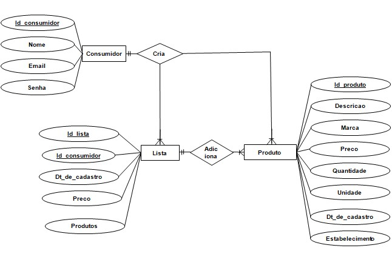

# Arquitetura da Solução

Definição de como o software é estruturado em termos dos componentes que fazem parte da solução e do ambiente de hospedagem da aplicação.

## Diagrama de Classes

Na engenharia de software, um diagrama de classes é um tipo de diagrama de estrutura estática que descreve a estrutura de um sistema mostrando as classes do sistema, seus atributos, operações e os relacionamentos entre os objetos.

No diagrama, as classes são representadas com caixas que contêm três compartimentos: O compartimento superior contém o nome da classe. É impresso em negrito e centralizado, e a primeira letra é maiúscula. O compartimento do meio contém os atributos da classe. Eles são alinhados à esquerda e a primeira letra é minúscula. O compartimento inferior contém as operações que a classe pode executar. Eles também são alinhados à esquerda e a primeira letra é minúscula. Uma classe com três compartimentos.No projeto de um sistema, várias classes são identificadas e agrupadas em um diagrama de classes que ajuda a determinar as relações estáticas entre elas. Na modelagem detalhada, as classes do projeto conceitual são frequentemente divididas em subclasses.

## Modelo ER

O Modelo ER representa através de um diagrama como as entidades (coisas, objetos) se relacionam entre si na aplicação interativa.]

Na figura abaixo é mostrado o Modelo Relacional(MR) desenvolvido na plataforma "XXXXX" para o projeto.

## Esquema Relacional

O Esquema Relacional corresponde à representação dos dados em tabelas juntamente com as restrições de integridade e chave primária.

Na figura abaixo é mostrado o Esquema Relacional(ER) desenvolvido no próprio banco de dados para o projeto.

## Modelo Físico

Entregar um arquivo banco.sql contendo os scripts de criação das tabelas do banco de dados. Este arquivo deverá ser incluído dentro da pasta src\bd.

## Tecnologias Utilizadas

As tecnologias utilizadas são Dashboard - Expo código, SQlite, DBaver, React Native, linguagens: HTML, CSS, JavaScript.

## Hospedagem

A hospedagem do projeto feita no "GitHub", a do banco de dados utiliza-se o "DBaver" e o banco de dados "SQlite".
> **Links Úteis**:
>
> - [Website com GitHub Pages](https://pages.github.com/)
> - [Programação colaborativa com Repl.it](https://repl.it/)
> - [Getting Started with Heroku](https://devcenter.heroku.com/start)
> - [Publicando Seu Site No Heroku](http://pythonclub.com.br/publicando-seu-hello-world-no-heroku.html)

## Qualidade de Software

As sub-características que a equipe usará são: Apreensibilidade: listada no RNF-04, prezando pelo fácil acesso do usuário na aplicação;

Segurança de acesso: listada no RNF-01, para prezar pela segurança do usuário;

Operacionalidade: com relação ao requisito listado no RNF-05, focando no bom desempenho e na facilidade de operar na aplicação;

Conformidade: focando no padrão e na portabilidade do software;

Capacidade para ser instalado: o software será capaz de ser instalado em dispositivos mobile;

Testabilidade: testando com facilidade as alterações feitas no software.

