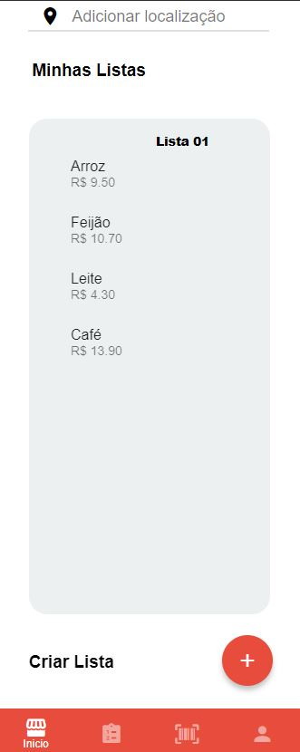

# Programação de Funcionalidades

Pré-requisitos: <a href="2-Especificação do Projeto.md"> Especificação do Projeto</a>, <a href="3-Projeto de Interface.md"> Projeto de Interface</a>, <a href="4-Metodologia.md"> Metodologia</a>, <a href="3-Projeto de Interface.md"> Projeto de Interface</a>, <a href="5-Arquitetura da Solução.md"> Arquitetura da Solução</a>

Implementação do sistema descritas por meio dos requisitos funcionais e/ou não funcionais. Deve relacionar os requisitos atendidos os artefatos criados (código fonte) além das estruturas de dados utilizadas e as instruções para acesso e verificação da implementação que deve estar funcional no ambiente de hospedagem.

Para cada requisito funcional, pode ser entregue um artefato desse tipo

A implementação relacionada a 3 etapa se encontra anexada:  
https://github.com/ICEI-PUC-Minas-PMV-ADS/pmv-ads-2022-2-e3-proj-mov-t1-time5_melhorcompra/tree/main/src/Project

Snack - Expo: https://snack.expo.dev/@laislima/eixo3melhorcomprapart3?platform=web  
JSON Server: https://tough-carrots-accept-179-220-230-245.loca.lt/

### Kenia - Homepage
Nessa etapa fiquei responsável pela Homepage, como pode ver no video abaixo, a parte de adicionar localização eu ainda estou trabalhando, tentando retornar o endereço na tela. Link do youtube: https://www.youtube.com/watch?v=SOmN6xiXBLM

### Sabrina - Alterar Senha e Deletar Conta
Nessa etapa fiquei responsável pela tela de alterar senha e deletar conta, o vídeo da apresentação de como ficou o funcionamento da tela se encontra no link do YouTube abaixo, as funcionalidades ligadas ao banco de dados ainda está sendo trabalhada para a próxima etapa.

**Link do vídeo**:
https://youtu.be/rKSbKfHl4S8

#### Telas:

-----------------

-----
> **Links Úteis**:
>
> - [Trabalhando com HTML5 Local Storage e JSON](https://www.devmedia.com.br/trabalhando-com-html5-local-storage-e-json/29045)
> - [JSON Tutorial](https://www.w3resource.com/JSON)
> - [JSON Data Set Sample](https://opensource.adobe.com/Spry/samples/data_region/JSONDataSetSample.html)
> - [JSON - Introduction (W3Schools)](https://www.w3schools.com/js/js_json_intro.asp)
> - [JSON Tutorial (TutorialsPoint)](https://www.tutorialspoint.com/json/index.htm)
