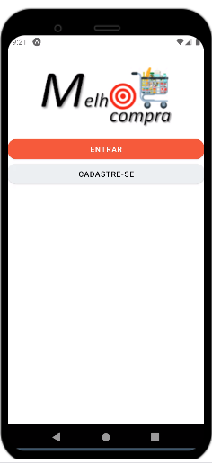

# Programação de Funcionalidades

Pré-requisitos: <a href="2-Especificação do Projeto.md"> Especificação do Projeto</a>, <a href="3-Projeto de Interface.md"> Projeto de Interface</a>, <a href="4-Metodologia.md"> Metodologia</a>, <a href="3-Projeto de Interface.md"> Projeto de Interface</a>, <a href="5-Arquitetura da Solução.md"> Arquitetura da Solução</a>

Implementação do sistema descritas por meio dos requisitos funcionais e/ou não funcionais. Deve relacionar os requisitos atendidos os artefatos criados (código fonte) além das estruturas de dados utilizadas e as instruções para acesso e verificação da implementação que deve estar funcional no ambiente de hospedagem.

Para cada requisito funcional, pode ser entregue um artefato desse tipo

A implementação relacionada a 3 etapa se encontra anexada:  
https://github.com/ICEI-PUC-Minas-PMV-ADS/pmv-ads-2022-2-e3-proj-mov-t1-time5_melhorcompra/tree/main/src/Project

Snack - Expo: https://snack.expo.dev/@geovanevlg/eixo3melhorcomprapart3?platform=web  
JSON Server: https://olive-walls-stand-179-220-230-245.loca.lt

### Kenia - Homepage
Nessa etapa fiquei responsável pela Homepage, como pode ver no video abaixo, a parte de adicionar localização eu ainda estou trabalhando, tentando retornar o endereço na tela. Link do youtube: https://www.youtube.com/watch?v=SOmN6xiXBLM

### Laís - Lista
Fiquei responsável pela tela referente a pesquisa dos produtos e consequentemente criação da lista, estarei responsável também pela page do código de barras que será em etapas futuras. Link do youtube: https://youtu.be/X-FBzKyjUHU

### Sabrina - Alterar Senha e Deletar Conta
Fiquei responsável pela tela de alterar senha e deletar conta, estarei focada na tela de alterar senha, espero implementar o deletar conta no futuro, o vídeo da apresentação de como ficou o funcionamento da tela se encontra no link da parte 2 do YouTube abaixo, as funcionalidades ligadas ao banco de dados não consegui faze-la, está dando erros,mas acredito que nessa última estapa estará pronta.

**Link do vídeo**:
Parte 1: https://youtu.be/rKSbKfHl4S8      Parte 2: https://youtu.be/v7HnM7bvAsE

#### Telas:

-----------------

#### Parte 2

### Werlon - Tela inicial, tela login, tela cadastro de usuário e serviços back-end utilizando uma Web API
Nesta etapa fiquei com a responsabilidade de desenvolver 3 telas da aplicação, sendo elas, tela inicial, tela de login e tela de cadastro,  e fui também responsável por desenvolver o serviço de back-end utilizando uma web api. Para o desenvolvimento das telas utilizei como fontes de conhecimento o material didático do microfundamento de aplicações móveis, a documentação dos softwares utilizados e também consultei fontes externas, porque para alguns temas, as informações contidas no microfundamento foram insuficientes e algumas vezes confusas. Cito como exemplo a seqüência de vídeos para criação do serviço de web api que achei um pouco confusas. Abaixo mais detalhes das páginas e serviços construídos e fontes externas.

**Link do vídeo**:
https://www.youtube.com/watch?v=Bk0xUIVLvTM

Fontes externas
Exportar uma pasta e/ou arquivo para github
https://www.youtube.com/watch?v=jAT651QFBcM

Localtunnel
https://www.youtube.com/watch?v=xEgKvr-oqIg&t=318s

#### Tela inicial

#### Tela de login

#### Tela de cadastro de usuários

#### Códigos fonte dos serviços de web api json

#### Web API funcionando no servidor Localtunnel

#### Web API funcionando no servidor Localtunnel - rota de usuários

### Geovane - Tela Perfil, Tela Estabelecimentos, Navegação por TabBar e demais rotas
Nesta etapa fiquei com a responsavel por desenvolver 2 telas da aplicação, tela perfil e tela de estabelecimentos, e fui também responsável por desenvolver a navegação pela Tab Bar e as demais rotas de navegação.

**Link do vídeo**:
https://www.youtube.com/watch?v=VY_UtGJqI6s
**Parte 2**:
https://www.youtube.com/watch?v=-SlQV8FJ88o

#### Tela Perfil

#### Tela Estabelecimentos

#### Aqruivo processedList.services.js

#### Aqruivo processedList.js

-----
> **Links Úteis**:
>
> - [Trabalhando com HTML5 Local Storage e JSON](https://www.devmedia.com.br/trabalhando-com-html5-local-storage-e-json/29045)
> - [JSON Tutorial](https://www.w3resource.com/JSON)
> - [JSON Data Set Sample](https://opensource.adobe.com/Spry/samples/data_region/JSONDataSetSample.html)
> - [JSON - Introduction (W3Schools)](https://www.w3schools.com/js/js_json_intro.asp)
> - [JSON Tutorial (TutorialsPoint)](https://www.tutorialspoint.com/json/index.htm)
